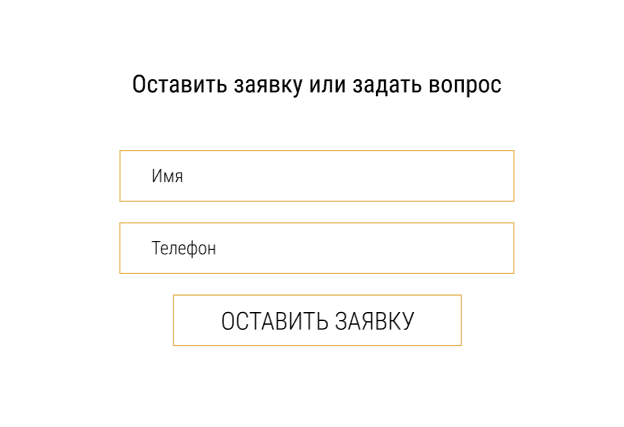

# Лабораторная работа №1 "BEM"

## human body

```
.head
.head__eyes
.head__nose
.head__mouth
.head__eyes--green
.head__nose--small
.head__mouth--big

.body
.body__neck
.body__chest
.body__stomach
.body__neck--long

.arms
.arms__shoulder
.arms__hand
.arms__fingers
.arms__fingers--thin

.legs
.legs__knee
.legs__foot

```

## Emmet

### header


```
header.header>(nav.header__navigation>a.navigation__link*3)+a.header__phone
```
### form



```
form.form>p.form__title+(label.form__label>input.form__input)*2+button.form__button
```

### card


```
card.card>(ul.card__list>(li.card__item>h2.item__title+p.item_text)*4)>button.card__button
```

### footer


```
footer.footer>(h2.footer__title+.footer__contacts>(a.footer__contacts.contacts>img.contacts_icon+span.contacts_text)*2+a.footer__links*3)+p.footer_text
```
